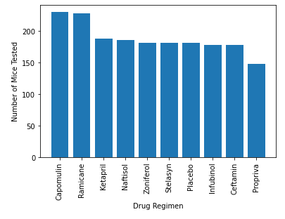
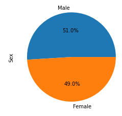
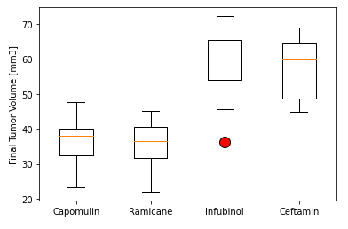
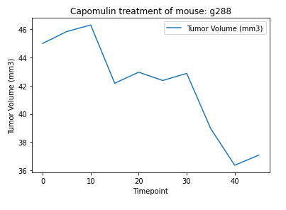
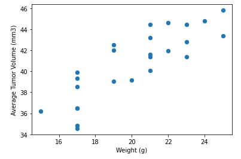
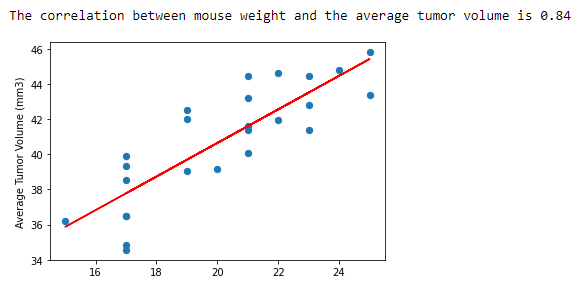

# Pymaceuticals Analysis

## Results
### Mice tested per Drug Regimen:

### Population Sex:

### Tumor Volume per Drug Regimen:

### Capomulin treatment of mouse:

### Tumor Volume vs Weight:

### Linear Regression:

## Conclusion
* Capomuline and Ramicane show the best results in average tumor volume and have less variance, meaning the response from the mouse organism tends to be more consistent comparing to other drugs.
* All drug regimens had a population of 25 mice, however not all timepoints were registered for each mouse, look at `Mice per Drug Regimen` bar chart . The population mice that were tested were almost equal parts male and female.
* There seems to be a strong linear positive correlation (Pearson) between the mouse's weight and the average volume of the tumor through time, this was only tested in the Capomulin drug regimen.